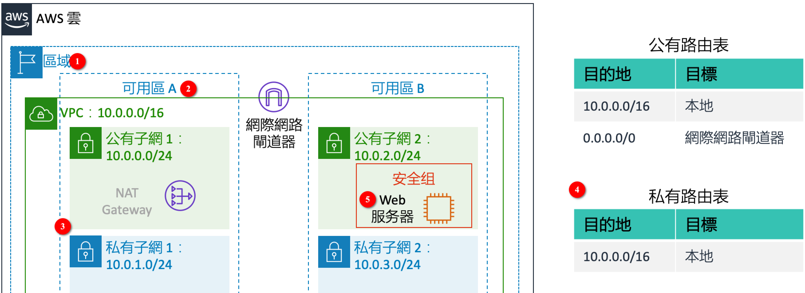
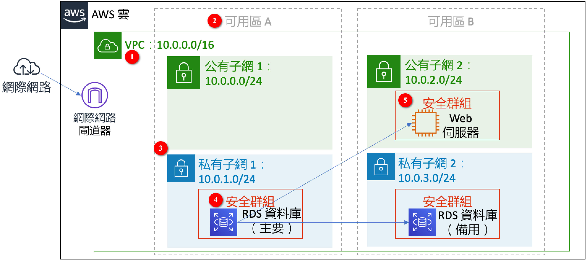
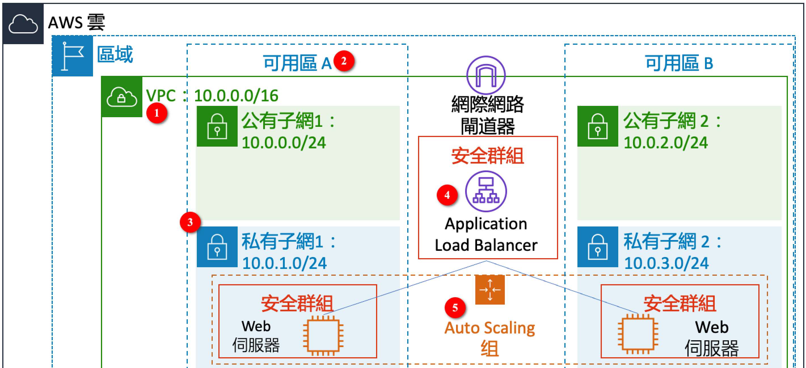

# AWS雲端運算基礎與實作
這本書主要是針對基礎的雲端運算從業人員教材為主。課本的內容以AWS Academy所提供的AWS Academy Cloud Foundations教材為主，並會提供額外的練習實驗，主要的程式語言會以 Python 來示範，使用者可以在自己的帳號下完成，或是利用 AWS Learner Lab學習帳號下完成。
這本書規劃成 5 個部分，從零開始帶你了解雲端運算的組成，並透過每個單元的實作讓你一步一步完成這份專案：
## 第一部分 AWS學習地圖
說明AWS專業證照的學習路徑。
  - Chapter 1. 認識 AWS 學習資源與認證
  - Chapter 2. AWS Academy LMS學習平台
  - Chapter 3.	申請AWS 帳戶
## 第二部分 雲端運算概念
包含雲端運算簡介、成本、AWS基礎設施與雲端安全責任共擔模型。
  - Chapter 4. 雲端概念
  - Chapter 5. 雲端經濟學與帳單
  - Chapter 6. AWS 全球基礎設施
  - Chapter 7. AWS 雲端安全
## 第三部分 AWS核心服務
介紹AWS的核心服務，包含了雲端網路配置、運算服務、儲存種類與資料庫等。
  - Chapter 8. 網路與內容分發
  - Chapter 9. 雲端運算
  - Chapter 10. 雲端儲存
  - Chapter 11. 雲端資料庫
## 第四部分 雲端運算架構與監控
雲端運算架構設計原則，如何進行自動擴展與監控。
  - Chapter 12. 雲端架構設計
  - Chapter 13. 自動擴展與監控
## 第五部分 AWS 認證與勳章
如何透過 AWS Academy 取得半價優惠券，準備考試練習與如何結合社群網路讓公司看到學習成效。
  - Chapter 14. 報考 AWS 認證
  - Chapter 15. 取得勳章

## 實驗1：構建 VPC 並啓動 Web 伺服器
本實驗將利用Learner Lab的資源，從無到有建構實驗場景的內容，實驗場景如下圖所示。  
❶在地區内建構一個VPC；  
❷兩個可用區A與B；  
❸每個可用區各自有兩個子網，一個為公有子網，一個為私有子網；公有子網可以透過Internet Gateway對外提供服務，私有子網則是可以透過NAT gateway存取網際網路資源，不可以對外提供服務，考慮實驗環境成本，本實驗不建立NAT gateway；  
❹公有子網關聯到公有路由表(Public Route Table)，而私有子網則是關聯到私有路由表(Private Route Table)；  
❺Web伺服器放在公有子網2。  

|   |
|:--:|
| <b>圖 1. Web伺服器位於AWS VPC</b>|

本實驗的任務如下：
- 建立 VPC。
- 建立子網。
- 配置安全組。
- 在 VPC 中啓動 EC2 執行個體。

## 實驗2：Amazon EC2
本實驗概述了如何啓動、管理和監控 Amazon EC2 執行個體以及調整其大小，而實驗環境將沿用實驗1在Learner Lab所建構的環境。本實驗的任務如下：
- 在啓用終止保護的情況下，啓動 Web 伺服器
- 監控EC2 執行個體
- 調整 Amazon EC2 執行個體的大小以進行擴展或縮減
- 探索 EC2 限制
- 測試終止保護
- 終止 EC2 執行個體

## 實驗 3：使用 EBS
本實驗著重介紹 Amazon Elastic Block Store (Amazon EBS)，這是一種適用於 Amazon EC2 執行個體的重要底層儲存機制。在本實驗中，學習如何新建 Amazon EBS 磁碟、將其附加到執行個體然後進行快照備份。要想成功完成本實驗，應熟悉有關使用 Amazon EC2 和管理 Linux 伺服器的基礎知識，最好應能熟練使用 Linux 命令行工具。本實驗的任務如下：
- 建立 Amazon EBS 磁碟區
- 將磁碟連接到EC2執行個體
- 使用SSH連線到EC2執行個體
- 在EC2執行個體內掛載磁碟
- 建立磁碟的快照
- 從快照建立新磁碟

## 實驗 4：構建資料庫伺服器
本實驗著重介紹 Amazon Relational Database Service (Amazon RDS)，可以讓用戶在雲端中輕鬆設定、操作和擴展關聯式資料庫。它在承擔耗時的資料庫管理任務的同時，又可提供經濟高效的可調容量，使用戶能夠騰出時間專注於應用程式和業務。本實驗的任務如下：
- 為 RDS 資料庫執行個體建立安全組
- 建立資料庫子網組
- 建立高度可用的 Amazon RDS 資料庫執行個體
- 建立 Amazon EC2 Web伺服器 
- Web 應用程式與Amazon RDS資料庫互動

實驗場景如圖2所示。  
❶在地區内建構一個VPC；  
❷兩個可用區A與B；  
❸每個可用區各自有兩個子網，一個為公有子網，一個為私有子網；公有子網可以透過網際網路閘道器對外提供服務，私有子網不對外提供服務；  
❹建立高度可用的Amazon RDS 資料庫執行個體，高度可用的具體實現就是建立一個RDS備用在不同的可用區；
❺Web伺服器放在公有子網2，並存取私有子網的Amazon RDS。  
 
|   |
|:--:|
| <b>圖 2. 建立高度可用的Amazon RDS執行個體架構</b>|

## 實驗 5：對架構進行擴展和負載平衡
本實驗將使用 Elastic Load Balancing (ELB) 和 Auto Scaling 服務對基礎設施進行負載平衡和自動擴展。Elastic Load Balancing 可以在多個 Amazon EC2 執行個體間自動分配傳入的應用程式流量，它可以實現應用程式容錯能力，從而無縫提供路由應用程式流量所需的負載平衡容量。  
本實驗的任務如下：
- 建立Web 伺服器
- 為 Auto Scaling 建立Amazon AMI。
- 建立負載平衡器。
- 建立啓動配置和 Auto Scaling 群組。
- 驗證負載平衡是否正常運行
- 測試 Auto Scaling組。

實驗場景如圖3所示。  
❶在地區内建構一個VPC；  
❷兩個可用區A與B；  
❸每個可用區各自有兩個子網，一個為公有子網，一個為私有子網；公有子網可以透過網際網路閘道器對外提供服務，私有子網不對外提供服務；  
❹在兩個公有子網內建立負載平衡器，以跨多個可用區運行；  
❺建立Auto Scaling 群組，會根據政策來啟動需要的Web伺服器在兩個私有子網內。  

|   |
|:--:|
| <b>圖 3. 具有自動擴展和負載平衡的架構</b>|
